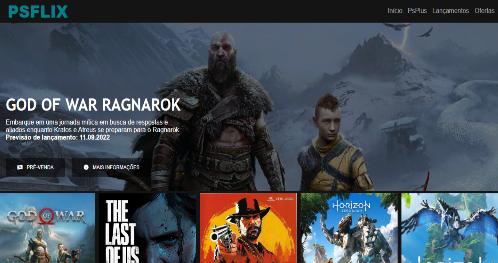
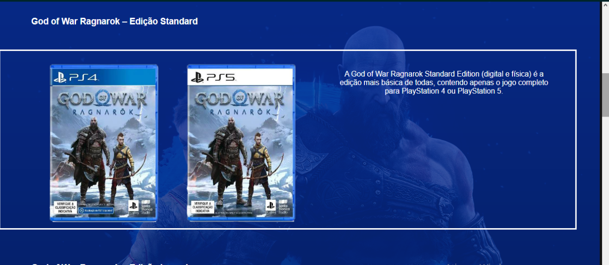

<h1 align = "center"> PSFLIX </h1>

***

<h3>Esse projeto tem como base num bootcamp realizadona DIO, o objetivo dele foi em construir um site(com base na página do NETFLIX) falando sobre o jogo mais esperado do ano por mim o GOW Ragnarok.</h3>

***

Técnologias usadas:
<ul> HTML </ul>
<ul> CSS </ul>
<ul> JavaScript(jQuery) </ul>

***

***

A primeira página contem a tecnologia jQuery para fazer o carrossel das imagens.
