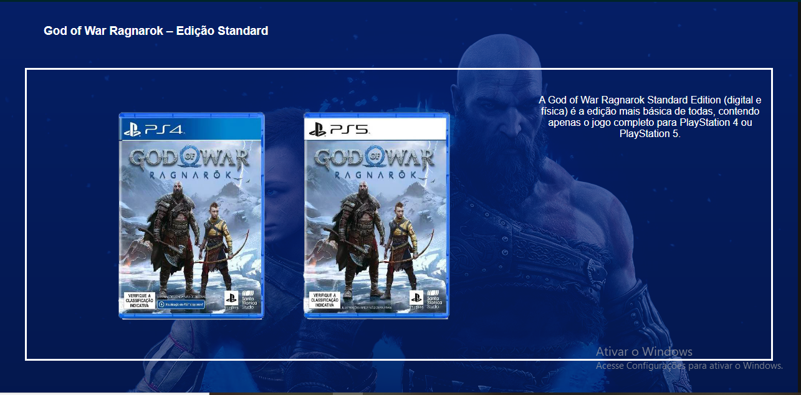
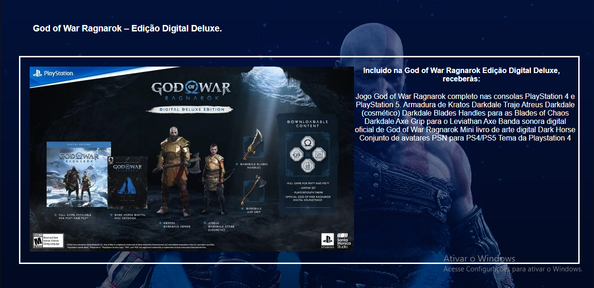

# 
 PSFLIX 

***

<h3>Esse projeto tem por objetivo construir um site(com base na página do NETFLIX) falando sobre o jogo mais esperado do ano por mim o GOW Ragnarok.</h3>

## 
 [Acessar PSFlix](https://psflix-jovemdevv.vercel.app) 

***

Técnologias usadas:
<ul> HTML </ul>
<ul> CSS </ul>
<ul> JavaScript(jQuery) </ul>

***

### Primeira pagina

### Segunda pagina

***

A primeira página contem a tecnologia jQuery para fazer o carrossel das imagens.
